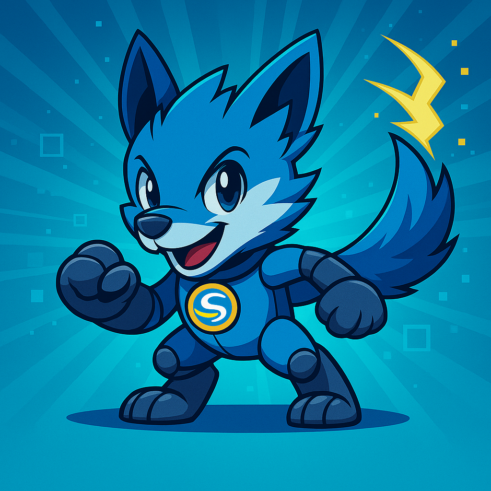

# Sigao Vibeathon 2024 — **Team Mascot Challenge**

## 🎮 Getting Started with the Test Harness

This repository includes a **Phaser 3 + Angular 19** game template to help you get started quickly!

### Prerequisites
- Node.js 18+ and npm installed
- Git for version control

### Quick Start
```bash
# Clone your team's branch
git clone -b <your-team-branch> https://github.com/sigaostudios/vibeathon-250814.git
cd vibeathon-250814

# Install dependencies
npm install

# Start the development server
npm run dev
# Opens at http://localhost:8080

# Or use Angular's dev server
ng serve
# Opens at http://localhost:4200
```

### Build for Production
```bash
# Build with analytics
npm run build

# Build without analytics
npm run build-nolog

# Output will be in dist/browser/
```

### Project Structure
```
src/
├── app/                    # Angular components
│   ├── app.component.ts    # Main UI with EventBus integration
│   └── phaser-game.component.ts  # Phaser game container
├── game/                   # Phaser game code
│   ├── scenes/            # Game scenes (Boot, MainMenu, Game, etc.)
│   ├── EventBus.ts        # Angular-Phaser communication bridge
│   └── main.ts            # Phaser configuration
└── assets/                # Images, sounds, sprites
```

### Test Harness Features
- **EventBus**: Bidirectional communication between Angular UI and Phaser game
- **Scene Management**: Pre-configured scene flow with transitions
- **UI Controls**: Angular components can control game state
- **Asset Pipeline**: Automatic asset loading and management

---

## 📋 **Project Brief**

### Overview

You and your team will **design, build, and deploy an original, interactive digital mascot**—a browser-based character with real personality and a live connection to something in the outside world. The mascot should be more than an animation: it must react, display emotion, respond to external events or data, and be fun to interact with.

**At least 80% of all code must be AI-generated and guided by your team.** (You can use tools like ChatGPT, Claude Code, Opencode, Copilot, etc.)

All work will be checked in to your team's branch on https://github.com/sigaostudios/vibeathon-250814.

---

## ✅ Core Requirements

### 1. **AI-Created and Guided**
- At least **80% of all project code** (JS/TS, assets, logic, config) must be written/generated by an AI tool, with your team acting as guide/editor
- You may use **Angular, Phaser, or any other frontend/browser-based tech** you want
- **All prompts, AI conversations, and code generation steps must be documented** in your repo's README or in a `/prompts` folder for auditability

### 2. **Mascot Personality**
- Your mascot must have a **defined personality**:
  - Give it a name, traits, and a unique backstory or attitude
  - It should display **different emotions or moods** in response to outside world events or user actions
  - It must have at least 3 distinct emotional states/expressions

### 3. **Connects to the Outside World**
- The mascot must be **driven by a real external data source**
- Example sources:
  - Codebase metrics (pull requests, issues, deploys, commit messages)
  - Weather API or real-time news
  - Team Slack/Discord/Teams channel events
  - Any other live, observable data (your team's choice)
- You are encouraged to **be creative** with this connection—think of fun or unexpected ways for the mascot to reflect real world activity!

### 4. **Interactivity**
- Users must be able to **interact** with the mascot through the browser (click, type, drag, play minigame, etc.)
- Interactions must result in **visible changes** in the mascot's behavior, mood, or environment
- The experience must feel "alive," not static

### 5. **Browser-Based and Deployable**
- Must be **100% browser-based**—works on Chrome/Edge/Firefox with no backend required beyond API calls or webhook listeners
- Must be **deployable and viewable** by the judges and all Sigao team members via a public URL
- All source code and assets must be checked into your team's branch on the Vibeathon repo

### 6. **Test Harness / Demo Mode**
- You must provide a **test harness or demo panel** that lets judges simulate all mascot moods and external data signals—no waiting for "real" events to occur
- The harness must be accessible in the deployed app and allow full demonstration of the mascot's reactions and features

### 7. **Documentation**
- Include a clear **README**:
  - How to run and deploy
  - How to use the test harness
  - What AI tools/prompts were used
  - What external data source(s) you connected
  - Mapping between triggers and mascot behavior

---

## 🏆 Judging Criteria

| Category | Weight | Description |
|----------|--------|-------------|
| **AI-Driven Code/Assets** | 25% | How effectively did you use AI to generate code and assets? |
| **Mascot Personality** | 15% | How engaging and well-defined is your mascot's character? |
| **Creativity of Connection** | 20% | How creative/unexpected is the connection to the outside world? |
| **Interactivity & Fun** | 20% | How fun and responsive is the user experience? |
| **Test Harness Quality** | 10% | How well can judges test all features? |
| **Documentation & Clarity** | 10% | How clear are your instructions and documentation? |

---

## 📚 Phaser Learning Resources

### Official Documentation
- **[Phaser 3 Documentation](https://photonstorm.github.io/phaser3-docs/)** - Complete API reference
- **[Phaser 3 Examples](https://phaser.io/examples)** - Hundreds of code examples
- **[Phaser 3 Tutorials](https://phaser.io/tutorials/getting-started-phaser3)** - Step-by-step guides

### Quick References
- **[Phaser 3 Cheatsheet](https://github.com/photonstorm/phaser3-docs/blob/master/cheatsheet.md)** - Quick command reference
- **[Scene Lifecycle](https://rexrainbow.github.io/phaser3-rex-notes/docs/site/scene/)** - Understanding init, preload, create, update
- **[Input Events](https://rexrainbow.github.io/phaser3-rex-notes/docs/site/touchevents/)** - Mouse, touch, and keyboard handling
- **[Animations Guide](https://photonstorm.github.io/phaser3-docs/Phaser.Animations.AnimationManager.html)** - Creating sprite animations

### Useful Tutorials
- **[Making Your First Phaser 3 Game](https://phaser.io/tutorials/making-your-first-phaser-3-game)** - Official beginner tutorial
- **[Phaser 3 + TypeScript](https://www.thepolyglotdeveloper.com/2020/09/phaser-3-typescript-tutorial-webgl-game/)** - TypeScript integration
- **[Phaser 3 Sprites and Images](https://www.patchesoft.com/phaser-3-sprites-and-images)** - Working with visual assets

### Angular + Phaser Integration
- **[Angular-Phaser Bridge Pattern](https://medium.com/@natalieamalia/integrating-phaser-3-with-angular-6e3e8fd7b07a)** - Communication between frameworks
- **[EventEmitter Pattern](https://angular.io/api/core/EventEmitter)** - Angular's event system for component communication

### Asset Resources
- **[OpenGameArt](https://opengameart.org/)** - Free game assets
- **[Kenney Assets](https://kenney.nl/assets)** - High-quality free game assets
- **[Freesound](https://freesound.org/)** - Free sound effects

### AI Tools for Game Development
- **[Claude Code](https://claude.ai/code)** - AI pair programming
- **[GitHub Copilot](https://github.com/features/copilot)** - AI code suggestions
- **[ChatGPT](https://chat.openai.com/)** - General AI assistance
- **[Cursor](https://cursor.sh/)** - AI-powered code editor

---

## 💡 Tips for Success

1. **Start Simple**: Get a basic mascot working first, then add complexity
2. **Use the EventBus**: It's already set up for Angular-Phaser communication
3. **Test Early**: Build your test harness as you go, not at the end
4. **Document AI Usage**: Keep a log of all AI prompts and responses
5. **Have Fun**: Be creative with your mascot's personality and reactions!

---

Good luck, and may the best mascot win! 🎉